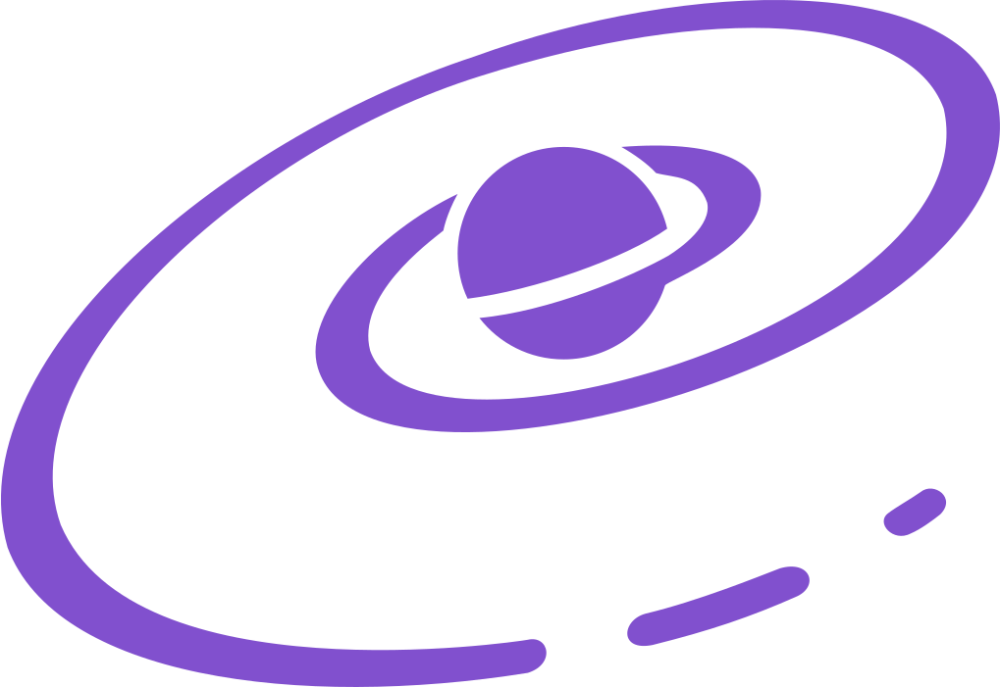

<p align="center">
  
</p>

<h1 align="center">Expressive MVC</h1>

<p align="center">
  Define reactive UI with plain classes. When properties change, your components will too.
</p>

<p align="center">
  <a href="https://expressive.dev/docs/">Documentation</a> ·
  <a href="https://expressive.dev/examples/">Playground</a> ·
  <a href="https://discord.gg/EBWC7HyTBd">Discord</a>
</p>

<p align="center">
  <a href="https://github.com/gabeklein/expressive-mvc/actions/workflows/release.yml"></a>
  <a href="https://github.com/gabeklein/expressive-mvc/actions/workflows/pr.yml"></a>
  <a href="LICENSE"></a>
</p>

Expressive puts application state, behavior, and lifecycle in plain classes. Class fields are reactive, getters are computed, methods are auto-bound, and UI components subscribe only to the values they read.

## Install

```bash
npm install @expressive/react
```

## Quick start

```tsx
import State from '@expressive/react';

class Counter extends State {
  count = 0;

  increment() {
    this.count++;
  }

  decrement() {
    this.count--;
  }
}

function CounterWidget() {
  const { count, increment, decrement } = Counter.use();

  return (
    <div>
      <button onClick={decrement}>-</button>
      <span>{count}</span>
      <button onClick={increment}>+</button>
    </div>
  );
}
```

No reducers, selectors, dependency arrays, or action wrappers. Update a property and every consumer that reads it updates automatically.

Continue with [Getting Started](https://expressive.dev/docs/getting-started/), explore the [guides](https://expressive.dev/docs/guides/state-classes/), or browse the [API reference](https://expressive.dev/docs/api/state/).

## Packages

| Package | Description |
| --- | --- |
| [`@expressive/react`](https://www.npmjs.com/package/@expressive/react) | React adapter and the recommended entry point for React applications. |
| [`@expressive/mvc`](https://www.npmjs.com/package/@expressive/mvc) | Framework-agnostic reactive core and component model. |
| [`@expressive/router`](https://www.npmjs.com/package/@expressive/router) | Host-agnostic router built on Expressive components. |
| `@expressive/preact` | Internal Preact adapter; not currently published. |

## Learn more

- [Why classes?](https://expressive.dev/docs/why-classes/)
- [Design decisions](skills/design.md)
- [Migrating from hooks](https://expressive.dev/docs/migrating-from-hooks/)
- [Comparisons with other state libraries](https://expressive.dev/docs/comparisons/)
- [Live examples](https://expressive.dev/examples/)
- [Using Expressive with a coding agent](skills/SKILL.md)

## Contributing

This repository is a Bun workspace. To get started:

```bash
bun install
bun run test
bun run build
```

See [AGENTS.md](AGENTS.md) for repository conventions and [.github/RELEASING.md](.github/RELEASING.md) for the release process.

## License

[MIT](LICENSE)
